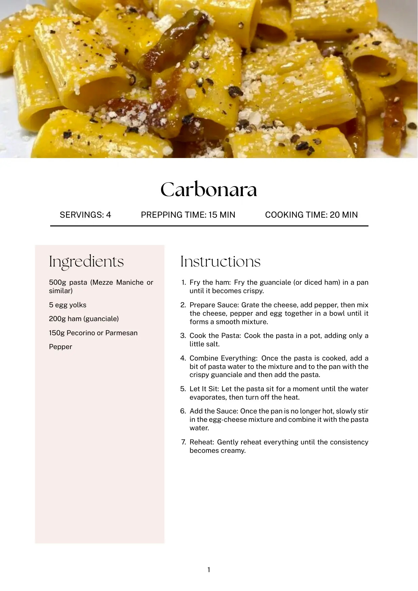

# 📚 LaTeX-Cookbook

A custom LaTeX system for building a beautifully formatted, modular cookbook from standalone recipe files.

Each recipe is written in its own `.tex` file and assembled into a complete PDF cookbook using GitHub Actions.

### 📖 Recipe Preview

Preview of a compiled recipe page:



---

## ✅ Features

- Modular recipe files
- Automatic scaling and cropping of recipe images
- Automatic PDF generation via GitHub Actions
- Versioned GitHub Releases with PDF download
- Custom `recipebook` LaTeX class

---

## 🔧 Compilation Requirement

This cookbook must be compiled using XeLaTeX, not pdflatex, in order to:

- Support Unicode characters
- Use system fonts
- Ensure proper layout as defined by the recipebook class

## 🌐 Language Settings

You can set the main language of your cookbook in the `recipebook.cfg` file:

```latex
% recipebook.cfg
% Set the main language of the cookbook.
% Change this to 'german', 'french', 'spanish', etc. to localize labels and babel.
\newcommand{\recipebooklang}{german}
```
> [!NOTE]
> Currently, English, German, French and Spanish are supported. More languages may be added in future updates.

---

## 📖 How It Works

1. Recipes are created as individual `.tex` files inside the `recipes/` folder, using a custom `recipebook` document class that defines the cookbook's layout and style.
2. The `main.tex` file assembles all content using `\input`, including the title page, table of contents, and individual recipes.
3. Images are automatically scaled and resized to fit the A4 page layout using the `process-images.yml` GitHub Actions workflow.
4. The `build-pdf.yml` workflow compiles the LaTeX source files and processed images into a formatted PDF.
5. The `release.yml` workflow creates a new GitHub Release and uploads the final PDF as a downloadable artifact.

## 🧑‍🍳 How to Add a New Recipe

Each recipe lives in its own `.tex` file inside the `recipes/` directory.

### 📄 Example: `recipes/SpaghettiBolognese.tex`

```latex
\setRecipeMeta{Spaghetti Bolognese}{4 servings}{15 min}{45 min}{./images/SpaghettiBolognese}

\begin{recipe}
  \begin{ingredients}
    \ingredient{400g spaghetti}
    \ingredient{2 tbsp olive oil}
    \ingredient{1 onion, chopped}
    \ingredient{2 garlic cloves, minced}
    \ingredient{400g ground beef}
    \ingredient{400g canned tomatoes}
    \ingredient{Salt and pepper to taste}
    \ingredient{Fresh basil, chopped}
  \end{ingredients}
  \begin{steps}
    \step{Cook the spaghetti according to package instructions. Drain and set aside.}
    \step{Heat olive oil in a pan. Sauté onion and garlic until translucent.}
    \step{Add ground beef and cook until browned.}
    \step{Stir in tomatoes, salt, and pepper. Simmer for 30 minutes.}
    \step{Serve sauce over spaghetti and garnish with basil.}
  \end{steps}
\end{recipe}
```

### 📷 Required Image

Each recipe **must** include an accompanying image file (e.g., `.jpg`, `.png`) placed in the `/images/` directory.

For example, for `recipes/SpaghettiBolognese.tex`, you should place the image at `images/SpaghettiBolognese.jpg`

> [!WARNING]
> **The image filename must match the path provided in** `\setRecipeMeta{...}{...}{...}{...}{./images/SpaghettiBolognese}`  

### 🧩 Include the Recipe in the Book

Add your new recipe to `main.tex` using `\input`:

```latex
\documentclass{recipebook}

\begin{document}
  \input{titlepage}
  \input{toc}
  \input{recipes/SpaghettiBolognese}
\end{document}
```

---

## 📌 TODOs & Improvements

- [ ] **Improve Table of Contents (`toc.tex`)**
- [ ] **Redesign `titlepage.tex`**
- [ ] **Auto-include recipes**
- [ ] **Auto-page layout**
- [x] **Localization**
- [x] **Inbuilt image scaling and cropping**
- [ ] **Publish as Overleaf template**

## 🤝 Contribute

Contributions are welcome! If you'd like to improve the project, fix bugs, or suggest features, please open a Pull Request (PR).

- Make your changes in a new branch and push it to your fork.
- GitHub Actions will automatically build the PDF on push.
- Write clear commit messages to help us review your changes.

Thank you for helping improve the cookbook!

## License

Distributed under the MIT License. See `LICENSE.txt` for more information.
